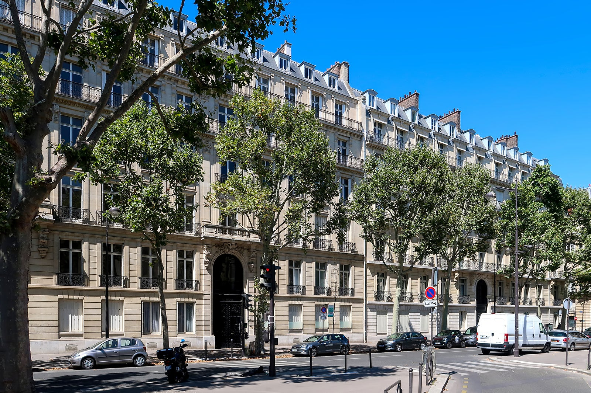
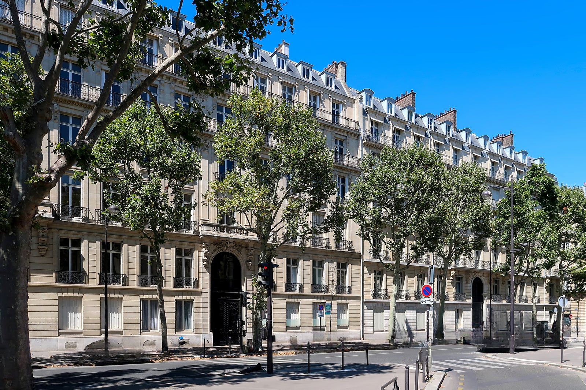

# Semantic Object Removal
Using semantic segmentation and in-painting to remove objects based on labels. Inspired by [Inpaint Anything](https://github.com/geekyutao/Inpaint-Anything) by  Tao Yu et al. Using [MaskFormer](https://github.com/facebookresearch/MaskFormer) for semantic segmentation to select areas to remove using [LaMa](https://github.com/advimman/lama) for in-painting.

## Installation
Install the Python requirements.
```
python -m pip install -r requirements.txt
```
Be sure to download the model weights for [LaMa](https://github.com/advimman/lama) (e.g., [big-lama](https://disk.yandex.ru/d/ouP6l8VJ0HpMZg)). Download the directory and put it in `./semremover/models/weights`.

## Usage
To use the script you can call it with various options. The first positional argument is the input path, which can point to either an image or a directory of images. To remove objects from a picture add them to the labels option when running the script. The default labels can be found in `./semremover/models/config/ade20k_labels.json`.

## Example
**input**
```
    python -m semremover example/paris.jpg --labels car minibike van
```



**output**


